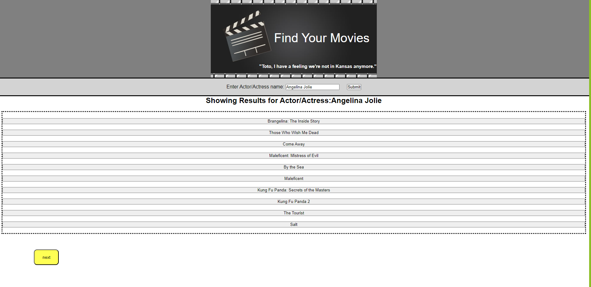

# workday_schedule

link: https://kaylachin90.github.io/workday_schedule/

## Description

-This challenge is for making a work day scheduling page.
-In this I needed to create a webpage, that loaded my workday schedule.

## Table of Contents (Optional)

If your README is long, add a table of contents to make it easy for users to find what they need.

- [Installation](#installation)
- [Usage](#usage)
- [Credits](#credits)
- [License](#license)

## Installation

1. Create a typical workday page and add css
2. Current day is displayed at the top of the calendar
3. Each timeblock is color coded to indicate whether it is in the past, present, or future
4. Can enter an event
5. click the save button for that timeblock
6. the text for that event is saved in local storage

## Usage

-Manage my time in a daily calender

## Credits

Collab: Corey Yates, my tutor

## License

Permissions of this strongest copyleft license are conditioned on making available complete source code of licensed works and modifications, which include larger works using a licensed work, under the same license. Copyright and license notices must be preserved. Contributors provide an express grant of patent rights. When a modified version is used to provide a service over a network, the complete source code of the modified version must be made available

## Badges

## Features

-Enter in workday and save.
